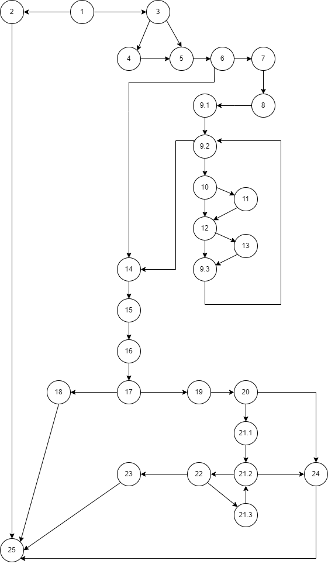

# SI_2023_lab2_213158
## Ања Шулајковска, бр. на индекс 213158
### Control Flow Graph 

### Цикломатска комплексност
#### Цикломатската комплексност на овој код е 11, истата ја добив преку формулата P+1, каде што P е бројот на предикатни јазли. Во случајoв P=10, па цикломатската комплексност изнесува 11.
### Тест случаи според критериумот Every Branch
#### Потребни се 5 тест случаеви (за да се помине секоја гранка)
### Тест случаи според критериумот Мultiple Condition
### Во овој случај имаме 4 тестови
